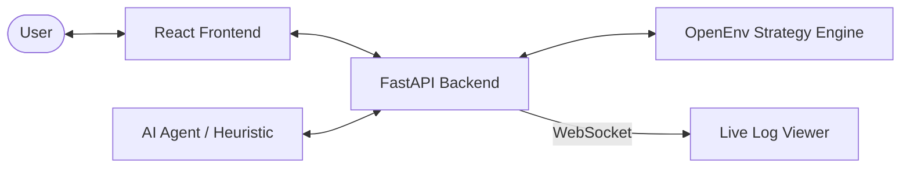
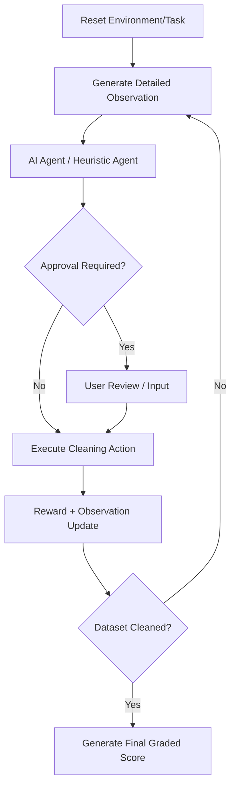

# 🧹 OpenEnv: Spreadsheet Data Cleanup

**OpenEnv** is a cutting-edge, agentic evaluation environment designed to test and benchmark AI agents on their ability to clean messy, real-world spreadsheet data. It provides a robust FastAPI backend combined with a premium React-based dashboard for real-time observability and interactive evaluation.

---

## 🏗️ System Architecture

OpenEnv is built as a three-tier system focusing on high performance and real-time feedback.



## 🔄 Agentic Workflow

The environment follows a standard RL (Reinforcement Learning) loop tailored for data cleaning tasks.



## ✨ Key Features

- **🚀 Real-Time Observability**: Integrated WebSocket server broadcasts judge-compliant logs (`[START]`, `[STEP]`, `[END]`) to the frontend in real-time.
- **🤖 Smart Heuristic Agent**: A built-in fallback agent that uses statistical rules (mean, mode, ffill) and intelligent casing normalization.
- **📊 Automated Grader**: Evaluation is performed using a multi-dimensional scoring algorithm:
  - **Issues Fixed**: Ratio of resolved vs. initial problems.
  - **Efficiency**: Step optimization.
  - **Compliance**: Adherence to approval requirements.
- **🛠️ Interactive Dashboard**:
  - **Live Terminal**: Fullscreen expandable console for trace review.
  - **Data Preview**: Dynamic grid showing issue highlights (missing, duplicate, inconsistent).
  - **Quick Fix**: One-click sequential execution of the heuristic agent.

---

## 🧩 Action and Observation Space

**Observation Space**: A structured `Observation` model containing:
- `task_id`, `step_count`, `max_steps`, `done` flag.
- `data_sample`: A snapshot of the dataset rows.
- `columns`: List of dataset columns.
- `issues_summary`: Count of `missing`, `duplicates`, and `inconsistent` issues.
- `issues`: A detailed list of current detected anomalies in the dataset.
- `column_stats`: Detailed statistics on a currently inspected column (availability: post inspection).
- `quality_score`: A real-time data health metric (0.0 - 1.0).

**Action Space**: A typed `Action` model. Supported operations:
- `inspect_column`: Analyze a column to populate `column_stats`.
- `fill_missing`: Impute missing values (strategies: `mean`, `median`, `mode`, `value`, `ffill`).
- `normalize_values`: Map inconsistent category names to a canonical standard.
- `remove_duplicates`: Deduplicate identical rows.
- `request_approval`: Ask for elevated permissions for a target restricted action.

**Approval Workflow**: Certain environments (like `hard.csv`) restrict dangerous operations (like removing duplicates). If an agent tries to execute a restricted action without permission, the action will fail and the agent loses points. The agent must first output a `request_approval` action for the restricted operation, let the evaluator (or heuristic logic) grant approval, and *then* execute the actual cleanup action.

---

## 📋 Task Descriptions

OpenEnv comes with three carefully designed environment difficulties:

- **🟢 Easy** (`easy.csv`)
  - **Description**: A simplistic dataset where only missing values exist. Focuses on straightforward imputation.
  - **Difficulty**: Easy
  - **Max Steps**: 20
  - **Approvals**: None required.
- **🟡 Medium** (`medium.csv`)
  - **Description**: Mixed issues including missing values, duplicate rows, and inconsistently cased department names.
  - **Difficulty**: Medium
  - **Max Steps**: 25
  - **Approvals**: None required.
- **🔴 Hard** (`hard.csv`)
  - **Description**: A large dataset with severe anomalies. Includes missing data, strict capitalization mismatch, duplicates, and strict policies.
  - **Difficulty**: Hard
  - **Max Steps**: 30
  - **Approvals**: MUST request approval prior to using `fill_missing` or `remove_duplicates`.

---

## 📈 Baseline Scores

The built-in inference script (`inference.py`) evaluates baseline agents against the 3 core tasks:

- **Heuristic Agent (Rule-based)**:
  - Easy: ~0.94
  - Medium: ~0.89
  - Hard: ~0.76 (Average ~0.86)
- **Baseline LLM (e.g., Llama-3.1-70b / GPT-4o)**: ~0.90 Average Score

To reproduce the baseline scores, use the inference script:
```bash
python inference.py
```

---

## 🚀 Getting Started

### Prerequisites
- Python 3.9+
- Node.js 18+
- npm (or yarn)

### 1. Backend Setup
```bash
# Clone the repository
git clone https://github.com/Davanahs/openEnv.git
cd openEnv

# Setup virtual environment
python -m venv .venv
source .venv/bin/activate  # macOS/Linux
# .venv\Scripts\activate  # Windows

# Install dependencies
pip install -r requirements.txt

# Option A: Run LLM via HuggingFace (Recommended for evaluation)
export HF_TOKEN="your_huggingface_token"

# Option B: Run LLM natively via OpenAI
export OPENAI_API_KEY="your_openai_key"

# Start the server
uvicorn app:app --host 0.0.0.0 --port 8000
```

### 2. Frontend Setup
```bash
cd frontend

# Install dependencies
npm install

# Start the development server
npm run dev
```
Open [http://localhost:3000](http://localhost:3000) to view the dashboard.

---

## 📡 API Reference

| Endpoint | Method | Description |
| :--- | :--- | :--- |
| `/reset` | `POST` | Start a new cleaning session (takes `task_id`). Returns `Observation`. |
| `/step` | `POST` | Perform a specific cleaning action. Returns `StepResult` + new `Observation`. |
| `/state` | `GET` | Get the full current state of the episode, including step counts. |
| `/report` | `GET` | Generate a detailed summary of the current session. |
| `/load_data` | `POST` | Upload custom CSV/Excel files for cleaning. |
| `/ws` | `WS` | WebSocket endpoint. Emits judge-compliant `[START]`, `[STEP]`, and `[END]` text strings in real-time. |

---

## 🤖 Tool Integration (Google AI Studio)

OpenEnv is designed to be easily integrated into Google AI Studio as a custom tool:
1. Start the server (and provide a public URL via `ngrok` if necessary).
2. Use the endpoint `http://<your-url>/openapi.json` to import the tool schema.
3. The AI agent can then call `inspect_column`, `fill_missing`, etc., as tool calls.

---

## 📊 Evaluation Metrics

The environment calculates a **Final Score (0.0 - 1.0)** based on:
- **50%** - Issues Fixed (Missing, Duplicates, Inconsistencies).
- **30%** - Data Quality (Statistical validity).
- **10%** - Efficiency (Minimizing steps).
- **10%** - Compliance (Avoiding unapproved actions).

---

## 📝 License
This project is licensed under the MIT License - see the LICENSE file for details.
